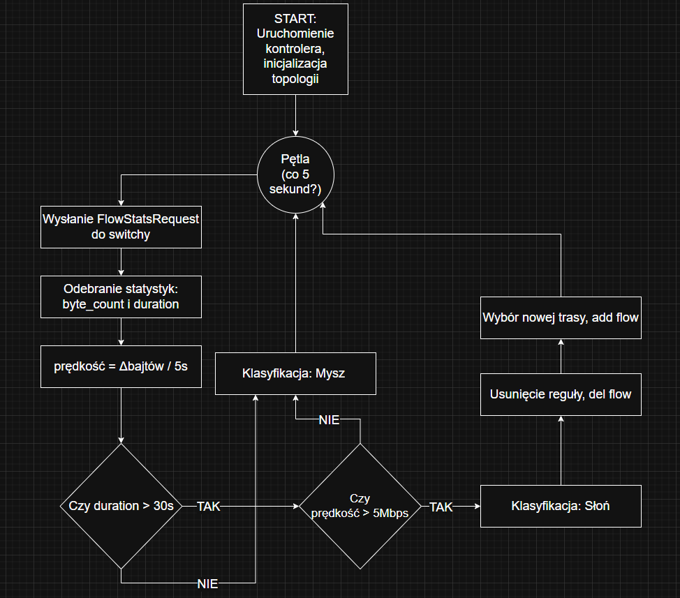

# ElephantFlowsSDN Project
Niniejsze repozytorium zawiera projekt zaliczeniowy na zajęcia z Sieci Sterowanych Programowo. Tematem projektu jest obsługa tzw. elephant flows w sieci przez kontroler Ryu. 

Elephant flows to charakterystyczny ruch w sieciach cechujący się dużym wolumenem danych przesyłanych w długim czasie. Zjawisko to skutecznie zapełnia dostępną przepustowość kanału, przepełnia bufory oraz negatywnie wpływa na zapewniania jakości obsługi (QoS) innych przepływów.

W tradycyjnych sieciach elephant flows łagodzi się poprzez mechanizmy kolejkowania oraz kontroli ruchu. w architekturze SDN należy podejść w inny sposób - poprzez implementację jakiegoś algorytmu, który zniweluje działanie takiego ruchu poprzez wykrycie go, a następnie obsłużenie.  

## Część praktyczna

Aby zaprezentować działanie naszego algorytmu przygotowaliśmy prostą sieć typu *tree* w programie Mininet. Jej schemat przedstawia się następująco:

### Topologia


Gdzie w naszym programie *leaf* 1, 2 oraz 3 zostały nazwane po prostu kolejno: s1, s2 ,s3. To samo dotyczy *spine'ów* - są to s4 oraz s5.

Topologię generujemy poprzez prosty skrypt napisany w pythonie. Jego nazwa to *eleflow_simple.py*, poniżej znajduje przedstawiamy listnig skryptu.

```python
from mininet.topo import Topo

class MyTopo(Topo):
    def build(self):

        # Spine'y
        s4 = self.addSwitch('s4')
        s5 = self.addSwitch('s5')

        # Leaf'y
        s1 = self.addSwitch('s1')
        s2 = self.addSwitch('s2')
        s3 = self.addSwitch('s3')

        # Hosty
        h1 = self.addHost('h1')
        h2 = self.addHost('h2')
        h3 = self.addHost('h3')
        h4 = self.addHost('h4')
        h5 = self.addHost('h5')
        h6 = self.addHost('h6')

        # Host → Leaf
        self.addLink(h1, s1)
        self.addLink(h2, s1)

        self.addLink(h3, s2)
        self.addLink(h4, s2)

        self.addLink(h5, s3)
        self.addLink(h6, s3)

        # Leaf → Spine
        self.addLink(s1, s4)
        self.addLink(s1, s5)

        self.addLink(s2, s4)
        self.addLink(s2, s5)

        self.addLink(s3, s4)
        self.addLink(s3, s5)

# Rejestracja topologii
topos = {
    'mytopo': (lambda: MyTopo())
}
```
### Hosting

Całość projektu hostowana jest zdalnie na serwerze w chmurze, dlatego niezbędne było wykorzystanie protokołu *SSH* do połączenia się z instancjami aplikacji.

### Generator ruchu

Generator ruchu, podobnie jak, topologia, napisany został w Pythonie. Skrypt ten działa w nieskończonej pętli, podczas której losowane są dwa rodzaje ruchu - *mouse flow* oraz *elephant flow*. Każdy z nim posiada konfigurowalne parametry z poziomu skryptu. *Mouse flow* charakteryzuje się krótkim czasem trwania, oraz małym payloadem, natomiast *elephant flow* jest odwrotnością - trwa długo oraz generuje duży ruch. Wartości przepływów są ustalane względem określonego przez nas baseline, stąd określenia "duży" czy "mały" wymagają definicji

```python
# Szansa wylosowania słonia
ELEPHANT_PROBABILITY = 0.15 # 15% szans 

# Mysz (Mouse Flow)
MOUSE_PACKET_SIZE = 50
MOUSE_INTERVAL_SEC = 0.2  # Wysyłaj co 200ms

# Słoń (Elephant Flow)
ELEPHANT_PACKET_SIZE = 1400
ELEPHANT_DURATION_SEC = 45 # Słoń trwa 45 sekund
```

Generator ten uruchamiany jest dzięki pomocniczemu skryptowi bashowemu, o nazwie run_generator.sh. Uruchamia on pętlę, w której losowany jest host, z którego odpalony zostanie skrypt random_sender.py, a ten z kolei generuje jeden z dwóch zdefiniowanych wcześniej charakterystycznych ruchów. Dzięki temu zapewniamy losowość przepływów na bazie adresu źródłowego oraz docelowego.

```bash
while true; do sudo mnexec -a $(pgrep -f "mininet:h[1-6]" | shuf -n 1) python3 random_sender.py; done
```

W celu generacji ruchu zastosowaliśmy bibliotekę scapy.



