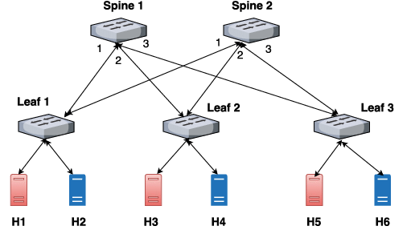

# ElephantFlowsSDN Project
Niniejsze repozytorium zawiera projekt zaliczeniowy na zajęcia z Sieci Sterowanych Programowo. Tematem projektu jest obsługa tzw. elephant flows w sieci przez kontroler Ryu. 

Elephant flows to charakterystyczny ruch w sieciach cechujący się dużym wolumenem danych przesyłanych w długim czasie. Zjawisko to skutecznie zapełnia dostępną przepustowość kanału, przepełnia bufory oraz negatywnie wpływa na zapewniania jakości obsługi (QoS) innych przepływów.

W tradycyjnych sieciach elephant flows łagodzi się poprzez mechanizmy kolejkowania oraz kontroli ruchu. w architekturze SDN należy podejść w inny sposób - poprzez implementację jakiegoś algorytmu, który zniweluje działanie takiego ruchu poprzez wykrycie go, a następnie obsłużenie.  

